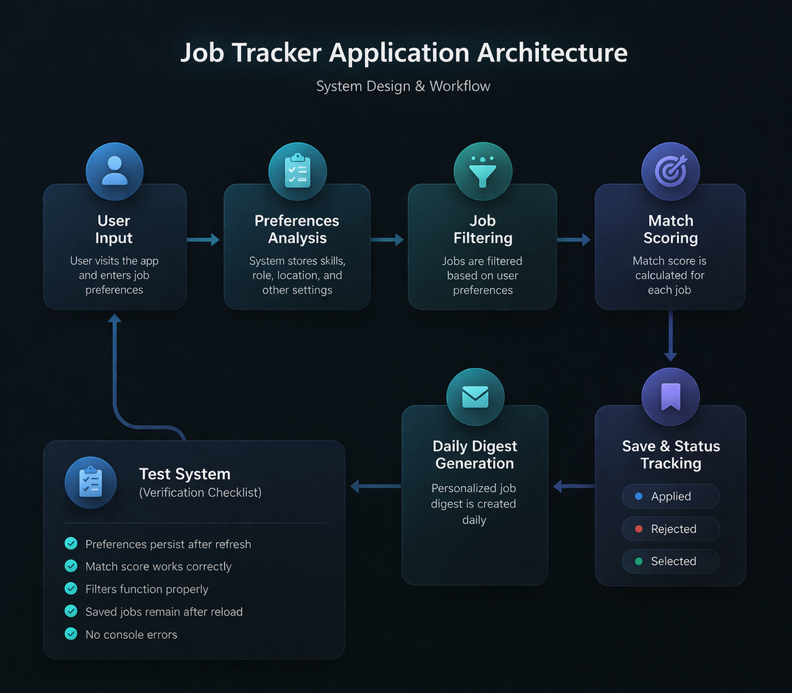
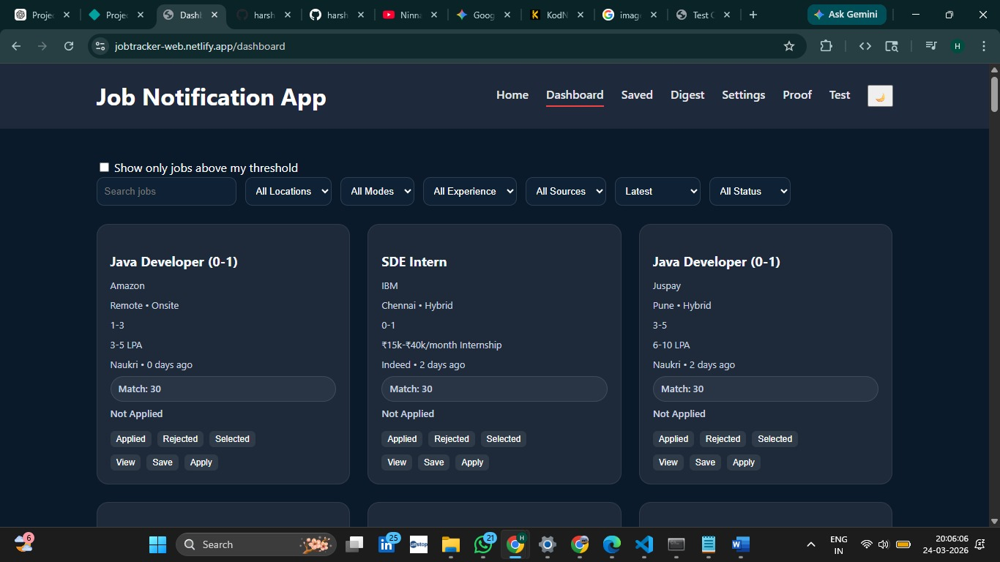
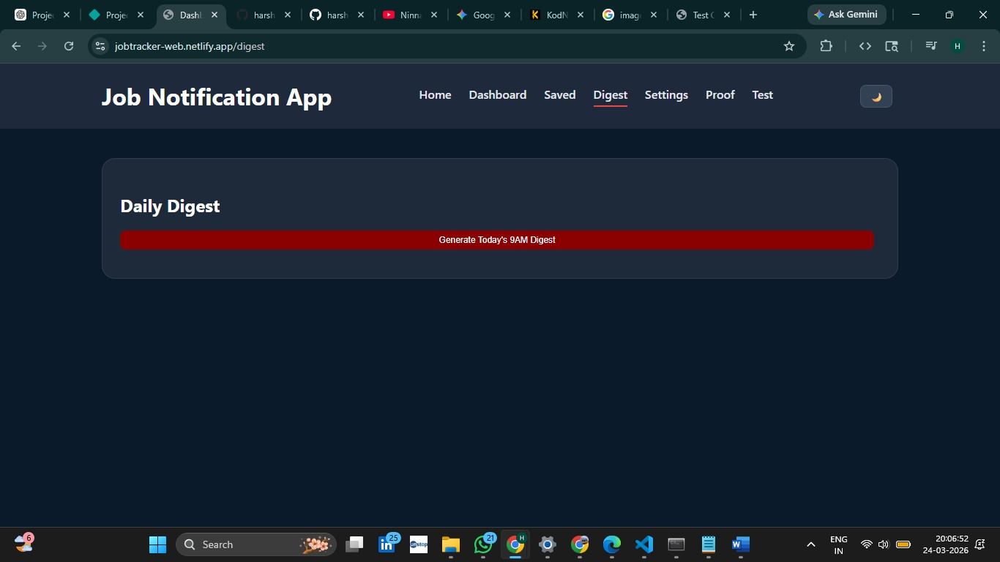
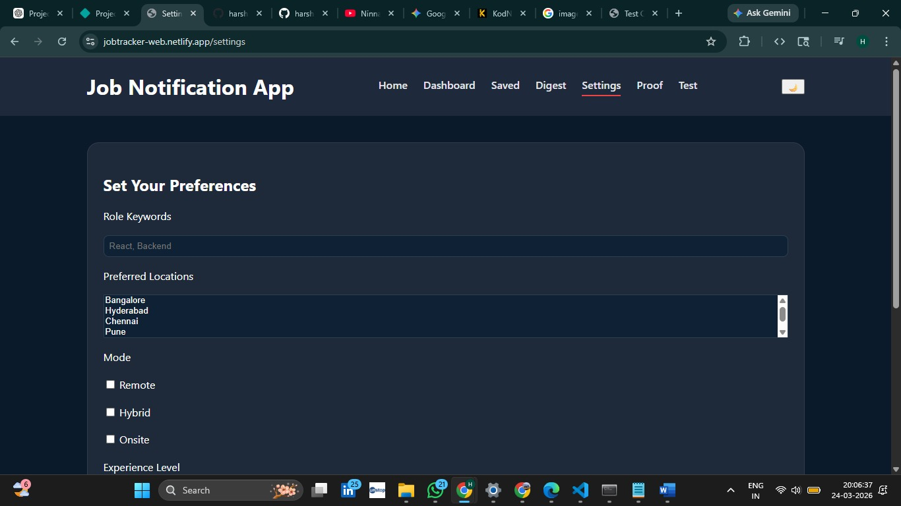

# Job Notification Tracker

> A web-based application designed to help users discover, track, and manage job opportunities efficiently using personalized preferences and smart filtering.

Job Notification Tracker is a frontend-driven application that allows users to explore jobs, save them, track application status, and receive a daily digest of relevant opportunities.

The system uses user-defined preferences such as role, location, skills, and experience level to filter and match jobs effectively.

---

## Important Note

This repository contains the complete implementation of the Job Notification Tracker web application.

All features are built using frontend technologies and local storage for persistence. No backend services are used in this version.

---

## Project Overview

Job searching can be overwhelming due to the large number of opportunities available across platforms.

Job Notification Tracker simplifies this process by:

- Allowing users to set job preferences
- Filtering jobs based on those preferences
- Calculating match scores
- Enabling job saving and tracking
- Generating a daily digest of top matches

---

## Problem Statement

Users often struggle to:

- Keep track of multiple job applications
- Find jobs that match their skills
- Organize saved opportunities
- Monitor application progress

This project solves these problems by providing a structured and interactive job tracking system.

---

## Live Website

https://jobtracker-web.netlify.app/

---

## High-Level System Architecture

    User Input (Preferences)
            ↓
    Preferences Stored (LocalStorage)
            ↓
    Job Data Processing
            ↓
    Job Filtering (Role, Location, Skills)
            ↓
    Match Score Calculation
            ↓
    Save & Track Jobs
            ↓
    Daily Digest Generation
            ↓
    Results Displayed to User

---

## System Architecture

---

## Application Screenshots

### Dashboard

### Saved Jobs

### Settings

---

## Working Process

1. User sets preferences in Settings page
2. Preferences are stored in LocalStorage
3. Jobs are filtered based on user inputs
4. Match scores are calculated
5. User can save jobs and track status
6. Daily digest generates top job matches
7. Data persists even after refresh

---

## Features

- Job filtering based on preferences
- Match score calculation
- Save jobs functionality
- Application status tracking (Applied, Rejected, Selected)
- Daily digest generation
- Dark/Light mode toggle
- Persistent data using LocalStorage
- Test checklist verification system

---

## Technologies Used

- HTML
- CSS
- JavaScript
- LocalStorage

---

## Repository Structure

    job-tracker-app/
    │
    ├── assets/
    │   ├── Dashboard.jpeg
    │   ├── Saved.jpeg
    │   ├── Settings.jpeg
    │   ├── Architecture.png
    │
    ├── index.html
    ├── dashboard.html
    ├── saved.html
    ├── digest.html
    ├── settings.html
    ├── proof.html
    ├── test.html
    ├── app.js
    ├── styles.css
    │
    └── README.md

---

## Results

The Job Notification Tracker successfully demonstrates how a frontend-based system can manage job tracking efficiently using browser storage.

The application provides:

- Smooth user experience
- Persistent data handling
- Functional job filtering and tracking
- Organized workflow for job seekers

---

## Author

HARSHITHA M V

Artificial Intelligence and Machine Learning Student

---

## Future Improvements

- Backend integration (Node.js / Firebase)
- Real-time job API integration
- Authentication system
- Resume upload & tracking
- Notifications system
